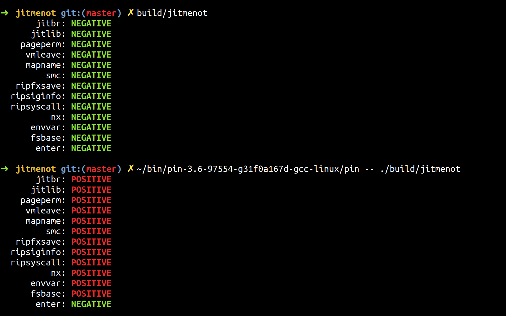
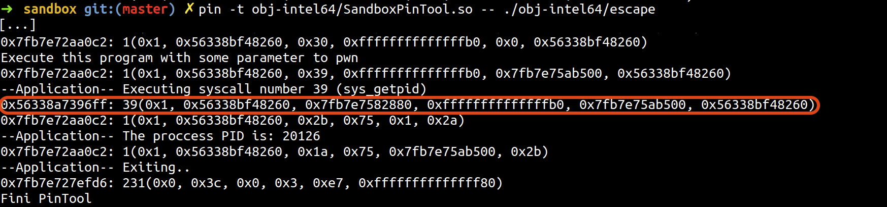
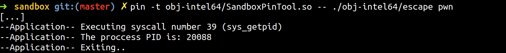

## PwIN - Pwning Intel piN

This repository contains supporting material for my master thesis `Security Evaluation of Dynamic Binary Instrumentation Engines` supervised by Julian Kirsch ([@kirschju](https://github.com/kirschju)).

### DBI Engines Detection Tool *jitmenot*

Utilising different artefacts introduced by the instrumentation process in the program's execution, one can detect the underlying Dynamic Binary Instrumentation (DBI) engine. The developed tool called *jitmenot* employs 13 different DBI detection mechanisms and can be built with the provided `Makefile`. The resulting binary (`build/jitmenot`) is then ready to be executed in the context of any DBI framework. A red POSITIVE next to a detection mechanism indicates that it has revealed DBI engine's presence, while a green NEGATIVE signals that no instrumentation was detected.

In order to execute the *fsbase* test, one has to load a kernel module (`jitmenot/fsgsbase-mod`) using `make start` which allows the execution of the `rdfsbase` instruction in userspace, available only for Intel processors newer than Ivy Bridge. Finally, starting *jitmenot* with `-v` parameter prints additional information for each test case.
	
Functionality was tested on Linux `x86-64` with *Intel Pin*, *DynamoRIO*, *QBDI*, and *Valgrind*. Pull requests regarding new detection mechanisms are always welcome.
	


### Sandbox Escaping when Controlling Code and Data 
- `sandbox/SandboxPinTool.cpp`: Tracks all system calls executed by the instrumented application and prints basic information about them, for example syscall number, parameters.

- `sandbox/escape.c`: Escapes the DBI framework's sandbox by overwriting its own instrumented code. Executes one system call which is not registered by the tool as a proof of concept.
 



### Sandbox Escape when Controlling only Data
- `shadow/pwnccgen.py`: A python script that generates a program to a given Pintool which escapes DBI engine's sandbox by executing any assembly instructions, provided by the user via standard input.

- `shadow/ShadowStackTool.cpp`: A straightforward implementation of a Shadow Stack according to `ROPdefender: A Detection Tool to Defend Against Return-Oriented Programming Attacks` by Lucas Davi, Ahmad-Reza Sadeghi, and Marcel Winandy. This Pintool can be used to illustrate the sandbox escape technique performed by programs generated with `pwnccgen.py`.

- `pwin/pwn.py`: A python server that bootstraps an attack succeeding with probability 1:16 against an instrumented versions of `wget`, *1.19.2* and older (binary also provided in the same folder).

- `pwin/shell.c`: A simple program which spawns a shell only in a DBI environment by executing code residing on a non-executable stack.

### Further Information
More information about the core concepts can be found in the thesis. To experiment with the examples, one can build a Docker image using the provided `Dockerfile`. Alternatively, you can download an already built image from <https://hub.docker.com/r/zhechkoz/pwin>.

To create a container use:
```bash
docker run --privileged -i -t zhechkoz/pwin /bin/bash
```
